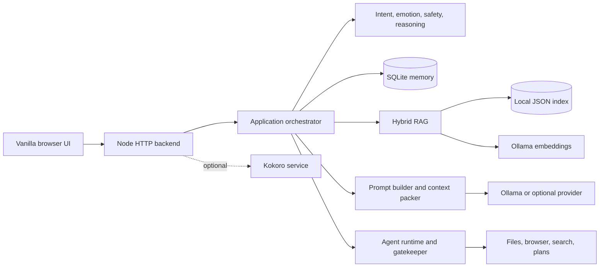

# Hazy

Hazy is a local-first AI companion and agent that uses Ollama for private chat, memory, retrieval, tools, browser tasks, code assistance, and optional speech.

Hazy keeps its normal conversation, retrieval, artifact, and provider-secret state on the machine running it. Cloud model providers and public web search are optional. They are used only when configured or requested, and data sent to them is then subject to those services' policies.

> Release status: pre-1.0. Hazy is designed for a trusted, single-user workstation. Do not expose its HTTP port to a LAN or the public internet.

## Screenshots

Screenshots have not yet been prepared for the repository. Suggested release screenshots:

- the main companion chat and model selector;
- a RAG answer with sources;
- an agent confirmation dialog;
- local health indicators for Ollama, embeddings, browser automation, and TTS.

## Features

- Ollama-first chat with optional OpenAI-compatible, Anthropic, Gemini, Groq, and NVIDIA adapters.
- SQLite conversation memory and scoped user/project memories.
- Local document ingestion with hybrid semantic and lexical retrieval and citation metadata.
- Intent, emotion, risk, reasoning, context packing, and response-review stages.
- Bounded agent loops, typed confirmations, tool schemas, audit decisions, and per-chat artifact storage.
- Isolated Playwright browser sessions with URL, DNS, redirect, and private-network controls.
- Code-request analysis, structured artifacts, calculator and planning tools.
- Optional Kokoro speech service that does not block text chat when unavailable.
- Vanilla browser frontend with streaming, source/tool displays, keyboard focus states, and runtime health status.
- Local diagnostics and an optional benchmark; no application telemetry is sent by default.

## Why Hazy exists

Many assistants make remote accounts, hosted storage, and cloud inference the default. Hazy starts from a different assumption: a useful companion should run on a personal computer, keep durable state there, and let the owner decide when a cloud service or public website is involved. Local-first does not mean risk-free; agent tools still need boundaries and users still need to review confirmations.

## Architecture



The canonical runtime is Node: `backend/server.js` forwards to `backend/src/infrastructure/web/server.js`. `backend/server.py` is retained as a limited compatibility proxy and does not provide full memory, RAG, or agent parity. See [Architecture](docs/ARCHITECTURE.md) for the verified request flow and component boundaries.

## Requirements

- Node.js 22.13 or newer. Hazy uses Node's built-in SQLite API.
- npm, included with Node.
- [Ollama](https://ollama.com/) running on the same machine for the default provider.
- A modern browser.
- Python 3.10-3.12 only for the optional desktop controller, compatibility proxy, or Kokoro service.
- Playwright's Chromium binary only for browser automation.

Windows 10/11 is the primary desktop path. The Node command-line startup is intended for current Linux and macOS systems and is checked in CI. The GUI controller is Windows-oriented. GPU acceleration is optional and depends on Ollama, the selected model, and the host.

## Quick start

1. Install Ollama and Node.js 22.13+.
2. Clone the repository and enter it.
3. Install the backend dependency:

   ```bash
   cd backend
   npm ci
   cd ..
   ```

4. Pull a small chat model and start Ollama:

   ```bash
   ollama pull llama3.2:1b
   ollama serve
   ```

5. Start Hazy.

   Windows:

   ```bat
   start.bat
   ```

   Linux or macOS:

   ```bash
   chmod +x start.sh
   ./start.sh
   ```

6. Open [http://127.0.0.1:8080](http://127.0.0.1:8080).

Run `check-system.bat` or `./check-system.sh` for a read-only JSON health report. Startup reports missing Ollama, missing models, unavailable embeddings, absent browser binaries, and optional TTS failures without preventing basic text chat.

### Ollama model setup

The default model is `ollama/llama3.2:1b`. To use a different installed model, select it in the UI or set `HAZY_MODEL`, including the `ollama/` prefix. Semantic retrieval defaults to `embeddinggemma`:

```bash
ollama pull embeddinggemma
```

If that embedding model is missing or embedding generation fails, retrieval uses lexical matching. Hazy does not download a model during normal startup.

### Browser automation

Browser tools are optional. From `backend/`, install the isolated Chromium binary:

```bash
npx playwright install chromium
```

Hazy blocks loopback, private-network, credential-bearing, and unsafe URL targets by default. Do not use the private-network override outside a trusted development environment.

### Optional Kokoro TTS

Create a separate Python environment so speech dependencies do not affect the core runtime:

```bash
python -m venv .venv-kokoro
```

Activate it, then install `requirements-kokoro.txt`. Set `HAZY_TTS=1` before starting Hazy to launch the local speech service through `scripts/start.cjs`, or run `python kokoro_server.py` yourself. The first voice request may need local model files supplied by Kokoro. If speech initialization fails, text chat remains available.

## Configuration

Copy `.env.example` values into your shell or process manager; the launcher does not automatically parse `.env`. Common settings are:

| Variable | Default | Purpose |
| --- | --- | --- |
| `HOST` | `127.0.0.1` | Backend bind address; keep loopback for normal use. |
| `PORT` | `8080` | Backend and frontend port. |
| `HAZY_MODEL` | `ollama/llama3.2:1b` | Primary provider/model identifier. |
| `OLLAMA_URL` | `http://127.0.0.1:11434` | Ollama endpoint. |
| `HAZY_EMBEDDING_MODEL` | `embeddinggemma` | Ollama embedding model. |
| `HAZY_CONTEXT_SIZE` | `4096` | Requested local context window. |
| `HAZY_RAG_CHUNKS` | `8` | Maximum RAG chunks supplied to packing. |
| `HAZY_AGENT_MAX_STEPS` | `5` | Agent model-turn budget before bounded grace. |
| `HAZY_DATA_DIR` | `cache/hazy-engine` | Private runtime state directory. |
| `HAZY_CONFIG_DIR` | `config` | Local configuration directory. |
| `HAZY_ALLOWED_ORIGIN` | local Hazy URL | Exact allowed browser origin. |
| `HAZY_MAX_BODY_BYTES` | 5 MiB | JSON request limit, bounded internally. |
| `HAZY_OFFLINE` | unset | Set to `1` to suppress orchestrator web search. |

Local `config/hazy-config.json` can define provider endpoints and defaults. It is ignored because older versions allowed plaintext keys there. Provider keys saved through the app are encrypted with AES-256-GCM and a local master key; the SQLite conversation database is not encrypted.

## Memory and RAG

Memory stores conversation state, summaries, and selected long-lived facts in local SQLite. Retrieval is scoped by caller-supplied user, conversation, and project IDs. Those IDs provide data separation inside a trusted local process; they are not remote authentication credentials.

RAG chunks local text, stores a local index, and ranks matching chunks. Ollama embeddings are cached in memory and deduplicated during a process lifetime. Lexical retrieval remains available when embeddings fail. Retrieved text is marked as untrusted context and cannot grant tool permissions. It can still influence model output, so citations and consequential claims should be reviewed.

## Agents, tools, and confirmations

The model sees only registered tool schemas. The gatekeeper validates arguments, roles, rate limits, guardrails, and confirmation state. High-risk operations return a pending confirmation bound to the user, chat, exact arguments, and expiry. Generated files remain under Hazy's private artifact directory, with traversal and symlink checks.

Browser and web content are untrusted. Network requests reject private destinations before and during redirects, and browser subrequests use the same public-address policy. Agent turns have a hard model-call cap and overall deadline. These controls reduce risk but are not an operating-system sandbox.

## Security model

Hazy assumes one trusted local user and loopback access. It has no multi-user login layer. Keep `HOST=127.0.0.1`, protect the operating-system account, and review agent confirmations. Logs intentionally omit message text, embeddings, keys, and arbitrary tool payloads by default. More detail, residual risks, and disclosure instructions are in [Security model](docs/SECURITY_MODEL.md) and [Security policy](SECURITY.md).

## Project structure

```text
backend/                  Node backend and limited Python proxy
  src/application/        Main chat orchestration and policies
  src/infrastructure/     HTTP server and vector storage
  agent/                  Agent loop, confirmations, audit, budgets
  browser/                Isolated browser sessions and safety
  memory/                 SQLite memory pipeline
  rag/                    Ingestion, chunking, embeddings
  security/               HTTP, network, path, schema, vault controls
  tools/                  Main registered tools
frontend/                 Vanilla browser UI
scripts/                  Startup, diagnostics, benchmark utilities
tests/                    Python controller tests
docs/                     Architecture, audit, security, troubleshooting
```

`backend/production/` is an experimental Express/Postgres/Redis variant. It is not the canonical local runtime and has not established feature or security parity.

## Testing

```bash
cd backend
npm ci
npm test
cd ..
python -m unittest discover -s tests -v
```

Run `node scripts/smoke.cjs` for a loopback startup/static/health/security-boundary smoke test.

Normal unit tests do not require a GPU, model download, browser binary, public network, Postgres, or Redis. Some tests use mocked service interfaces. Run the optional local benchmark with `node scripts/benchmark.cjs`; set `HAZY_BENCHMARK_MODEL=1` to include one real Ollama response. It prints timings and memory use, never prompt or response content.

To run the explicitly optional real-Ollama checks after installing both configured models, set `HAZY_OLLAMA_INTEGRATION=1` and run `npm run test:integration:ollama` from `backend/`. They never pull a model.

## Troubleshooting

Use `node scripts/doctor.cjs` first. Common fixes for unavailable Ollama, no installed model, ports already in use, unavailable embeddings, browser setup, Python version, and TTS are in [Troubleshooting](docs/TROUBLESHOOTING.md).

## Roadmap

- 0.1: harden first-run setup, CI, local diagnostics, and security boundaries.
- 0.2: improve offline frontend assets, source displays, cancellation, and browser smoke coverage.
- 0.3: add index migration/scale work, better model-specific token accounting, and reviewed plugin packaging.

## Contributing

Read [CONTRIBUTING.md](CONTRIBUTING.md) before opening a change. Small, tested changes that preserve local-first defaults and existing data formats are preferred. Report vulnerabilities privately according to [SECURITY.md](SECURITY.md).

## License

Hazy is licensed under the [MIT License](LICENSE). Dependencies, downloaded models, voices, and external services retain their own licenses and terms.
