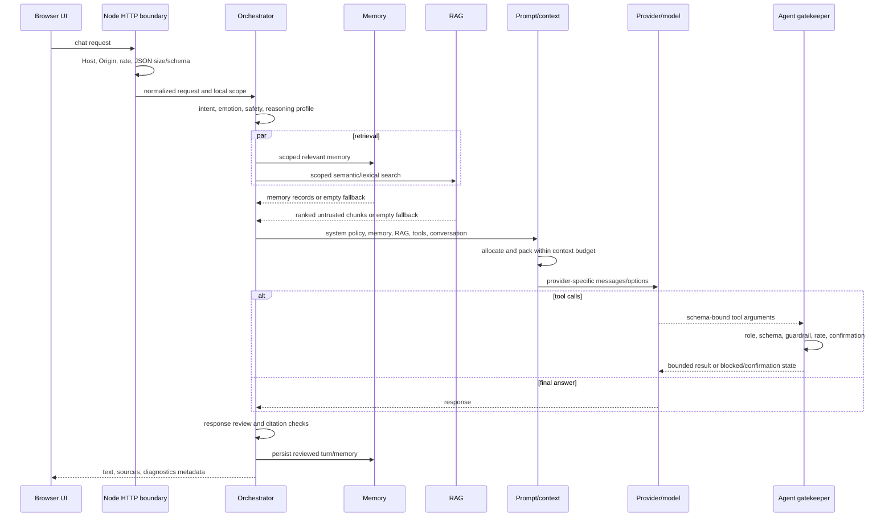

# Architecture

## Runtime roles

The canonical application is the Node HTTP server. `backend/server.js` is a compatibility entry point that exports `backend/src/infrastructure/web/server.js`. It serves the vanilla frontend and owns the complete chat, provider, memory, RAG, agent, browser, web-search, model-management, output, and TTS-proxy APIs.

`backend/server.py` remains a limited FastAPI compatibility proxy for Ollama, simple output endpoints, static files, titles/personas, and speech forwarding. It does not provide the Node memory, RAG, agent gatekeeper, or browser stack. Set `HAZY_BACKEND=python` only when that reduced behavior is intentional.

`kokoro_server.py` is a separate optional loopback service. It loads Kokoro lazily on the first speech request. Text chat does not depend on it. `backend/production/` is an experimental Express/Postgres/Redis variant and is outside the supported local runtime.

## Chat request flow

The orchestrator already constructs `OllamaEmbeddingService` and passes retrieved memory and RAG into the prompt/context pipeline. Retrieval failures return an empty context and do not stop ordinary chat. Semantic retrieval is used only when compatible stored embeddings and an embedding provider are available; lexical scoring remains the safe fallback.

## Storage

By default, private state is rooted at `cache/hazy-engine/`; `HAZY_DATA_DIR` can move it. Conversation and memory data use Node's built-in SQLite. RAG uses a local JSON index. Browser screenshots/events, confirmations, agent audit records, artifacts, metrics, and usage records also remain local. These locations are ignored by Git.

Provider credentials saved through the application use AES-256-GCM and a separate key. SQLite and JSON data are not encrypted. The master key and data must be protected together through operating-system permissions and full-disk encryption.

## Isolation and trust

User, conversation, and project IDs scope local records. The memory manager checks conversation ownership; RAG replacement/search/deletion keys include user/project/file scope; agent memory queries include conversation/project scope. These are application-level separation mechanisms for a trusted local caller, not an authentication system.

Retrieved documents, browser pages, web results, and model-generated tool arguments are untrusted. Context escaping and prompt labels reduce instruction confusion, while permission decisions remain in deterministic code. Agent files are constrained beneath the artifact root with lexical containment plus symlink/junction checks.

## HTTP and external networking

The default bind is `127.0.0.1`. The Node server validates Host and Origin, limits body size/depth and request rates, and emits generic server errors. The Python services apply equivalent loopback/Origin/body/rate middleware. These controls are designed for local access; binding to another interface does not add authentication.

Public web fetches allow HTTP/HTTPS only, reject URL credentials, resolve all addresses, reject private/reserved targets, pin the validated lookup into the request, bound response bytes, and revalidate redirects. Playwright routes subrequests through the same policy and blocks WebSockets/service workers/downloads by default.

## Context and model routing

The context manager protects current user content and system policy, summarizes older history, ranks RAG chunks, compresses tool output, and emits usage diagnostics. If the protected content itself cannot fit, it returns a 413-style error instead of silently discarding the policy. Token estimates are heuristic and may differ from a provider's tokenizer.

Model identifiers use `provider/model`. Ollama is the default and requires no cloud key. Optional providers load credentials from the secret vault/configuration. Provider response sizes and request deadlines are bounded. Agent calls share an overall deadline and a finite model-turn budget.

## Frontend

The frontend remains plain HTML, CSS, and JavaScript. It handles streaming chat, conversations, model selection, voice, source/tool cards, confirmations, generated previews, and runtime status. Generated previews use a sandboxed iframe without same-origin privileges. Some libraries/fonts are currently loaded from CDNs, so a fully offline first render is not yet guaranteed.

## Compatibility and migration policy

Data-format and endpoint compatibility should be retained when practical. New storage paths default to the same repository-local runtime area while allowing explicit overrides. Large module splits should be incremental and covered by endpoint tests. Removing the Python compatibility server or experimental production code requires reference analysis, a migration note, and passing tests without it.

